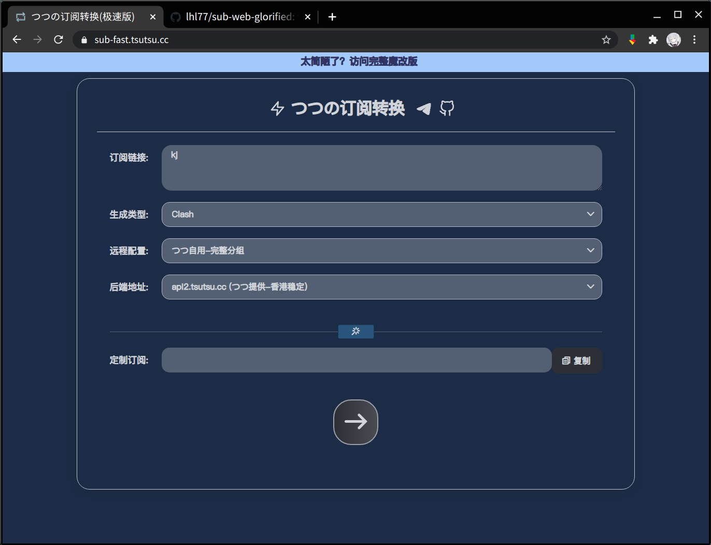

# つつの订阅转换

#### 拥有贼好看的主题,高速后端,优质规则

删除了src文件夹，以防内置远程配置和后端等被复制滥用

主题文件在/public/css/style.css

------

## 更新信息

**版本号：2104162042**

**更新时间：2021/04/16 20:42**

------

## 基本信息

内置远程配置：（Telegram投稿： [@Ox208](https://t.me/Ox208)）

| つつ自用 | 简要描述                 |
| :------: | ------------------------ |
| つつ自用 | 完整分组                 |
| つつ自用 | 完整分组+地区URLtest     |
| つつ自用 | 超jb精简分组(含国内分流) |

| **用户投稿** | **简要描述**            |
| :----------: | :---------------------- |
|   hope140    | 自用配置 (与Github同步) |
|   hope140    | 去广告配置              |
|   hope140    | 全分组                  |
|   Nine499    | 自用规则                |
|   AllenXu    | 精简版多国家            |
|   AllenXu    | 小机场专用配置          |

后端：（Telegram投稿： [@Ox208](https://t.me/Ox208)）

| 提供者           | 后端域名                                  | 备注                     |
| ---------------- | ----------------------------------------- | ------------------------ |
| つつ             | api.tsutsu.cc:520                         | 国内裸奔小鸡             |
| つつ             | api2.tsutsu.cc                            | 香港稳定                 |
| つつ             | ~~api-cf.tsutsu.cc~~<u>已隐藏，仍可用</u> | ~~cf-vercel~~            |
| 肥羊             | api.v1.mk                                 | 增强型-四端负载 (2H4G*4) |
| subconverter作者 | subcon.dlj.tf                             | 稳定                     |
| sub作者&lhie1    | api.dler.io                               | 稳定                     |
| sub-web作者      | api.wcc.best                              | 稳定                     |
| hope140          | api.hope140.live                          | vercel                   |
| Allen Xu         | sub.proxypoolv2.tk                        | vercel                   |
| 品云             | sub.id9.cc                                | 品各种云...              |
| shadows          | ~~sub-beta.now.sh~~<u>已隐藏，仍可用</u>  | ~~vercel-测试~~          |

------

## 完整版： [https://sub.tsutsu.cc](https://sub.tsutsu.cc) 

图片示例：

## 极速版： [https://sub-fast.tsutsu.cc](https://sub-fast.tsutsu.cc) 

#### (砍掉了部分功能)

图片示例：